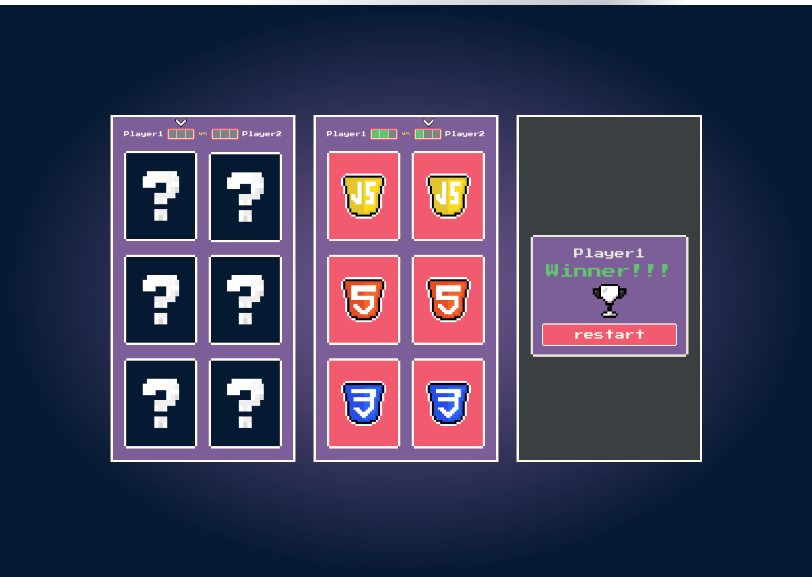

  

  <a href="#-tecnologias">Tecnologias</a>&nbsp;&nbsp;&nbsp;|&nbsp;&nbsp;&nbsp;
  <a href="#-projeto">Projeto</a>&nbsp;&nbsp;&nbsp;|&nbsp;&nbsp;&nbsp;
  <a href="#memo-licença">Licença</a>

 

## 🚀 Tecnologias

- HTML
- CSS
- JavaScript

## 🚧 Projeto

Live Preview: https://memoryy-gamee.netlify.app/

## 🎨 Layout:

Figma: <a href="https://www.figma.com/file/k8GPJJNlqcjXvnF6Nmk2XL/Matching-game">figma.com/file/k8GPJJNlqcjXvnF6Nmk2XL/Matching-game</a>

## 📝 Licença

Esse projeto está sob a licença MIT. Veja o arquivo [LICENSE](LICENSE) para mais detalhes.

---

Feito com ♥ by Pedro HS Paulino